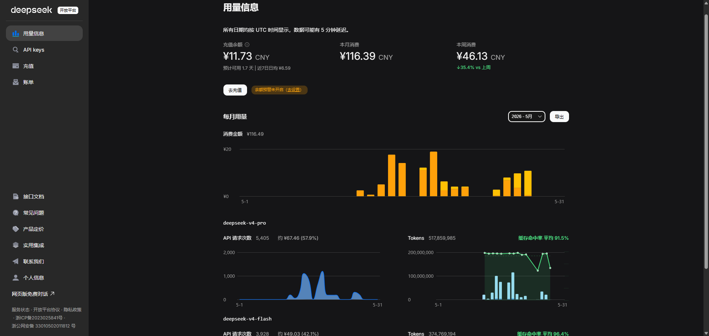

# DeepSeek Usage Plus

DeepSeek 开放平台用量页面的功能增强插件，在原有页面基础上自动增加数据分析和可视化功能，帮助你更直观地了解 API 使用情况。



## 功能

### 缓存命中率分析
- 在每日数据末尾自动追加缓存命中率，包含百分比和详细数值
- 在 Tokens 柱状图上叠加绿色折线，直观展示每日缓存命中率变化
- 标题栏显示全月平均命中率

### 消费趋势
- **本周消费**：展示本周消费总额，并与上周对比显示升降百分比
- **预计可用天数**：基于余额和近 7 日日均消费，自动计算预计可用天数

### 模型费用占比
- 按各模型的 Tokens 使用比例分摊总消费金额
- 在每个模型名称旁自动显示预估费用和占比

### 月份切换适配
- 切换查看不同月份时自动刷新所有数据，无数据时自动隐藏

## 安装

### 从 Chrome Web Store 安装
*待发布*

### 开发者模式安装
1. 下载本项目代码
2. 打开 Chrome 浏览器，进入 `chrome://extensions/`
3. 开启右上角的"开发者模式"
4. 点击"加载已解压的扩展程序"
5. 选择本项目所在文件夹

## 使用
安装后访问 [DeepSeek 用量页面](https://platform.deepseek.com/usage)，所有增强功能自动生效。

## 技术说明
- Manifest V3 架构
- 使用 content script 在隔离世界和主世界配合运行
- 直接从 SVG 图表解析数据，无需 API 调用
- 所有数据在浏览器本地处理，不上传任何信息

## 项目结构
```
deepseek-usage-plus/
├── manifest.json          # 插件配置
├── content.js             # 缓存命中率文字注入（隔离世界）
├── chart.js               # 图表叠加和数据分析（主世界）
└── icons/
    ├── icon16.png
    ├── icon48.png
    └── icon128.png
```

## License
MIT
